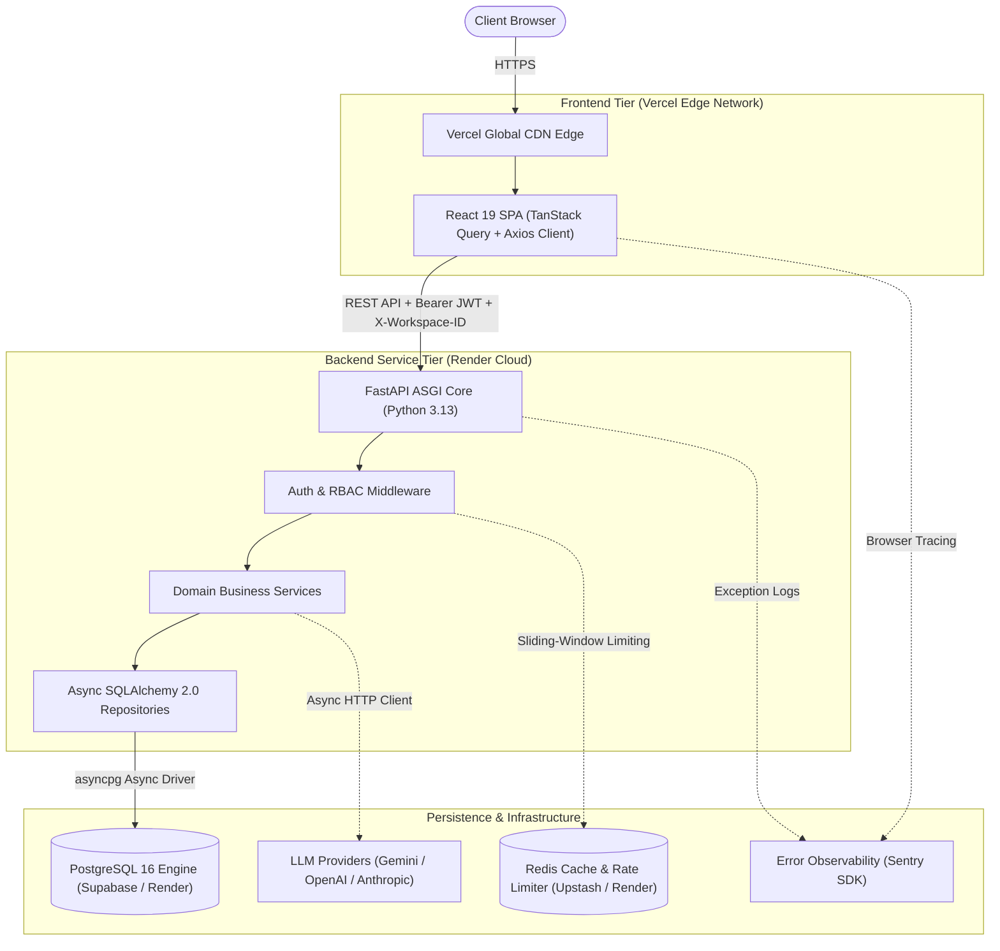

<div align="center">

# ⚡ AKIRA PM

### _Build the system your team actually runs._

[](https://akira-pm-frontend.vercel.app)
[](https://akira-pm.onrender.com/health)
[](LICENSE)

<p align="center">
  
</p>

**Akira PM** is a production-grade, multi-tenant workspace and project management platform designed for modern engineering organizations. Built on a decoupled **React 19 / Vite** frontend and an asynchronous **FastAPI / SQLAlchemy 2.0 / PostgreSQL** backend.

---

### [🚀 Open Live Application](https://akira-pm-frontend.vercel.app) &nbsp;•&nbsp; [📖 Architecture Specs](docs/architecture/HLD.md) &nbsp;•&nbsp; [🔌 API Reference](https://akira-pm.onrender.com/health)

---

</div>

<br/>

## 🛡️ Technology Badges

<div align="center">

| Layer              | Technologies                                                                                                                                                                                                                                                                                                                                                                                                                                                                                                                                                                                                                                                                               |
| :----------------- | :----------------------------------------------------------------------------------------------------------------------------------------------------------------------------------------------------------------------------------------------------------------------------------------------------------------------------------------------------------------------------------------------------------------------------------------------------------------------------------------------------------------------------------------------------------------------------------------------------------------------------------------------------------------------------------------- |
| **Frontend**       |       |
| **Backend**        |                                                                                                                                                                                           |
| **Data & Cache**   |                                                                                                                                                                                                                                                                                                                                                                                                                                                                      |
| **DevOps & Cloud** |                                                                                                                                                                                                                  |

</div>

---

## 🌐 Live Application

| Tier                 | Service                  | Production URL                                                                         |
| :------------------- | :----------------------- | :------------------------------------------------------------------------------------- |
| **Frontend Web App** | React 19 SPA (Vercel)    | [https://akira-pm-frontend.vercel.app](https://akira-pm-frontend.vercel.app)           |
| **Backend API Core** | FastAPI ASGI (Render)    | [https://akira-pm.onrender.com](https://akira-pm.onrender.com)                         |
| **Liveness Probe**   | Health Check (`/health`) | [https://akira-pm.onrender.com/health](https://akira-pm.onrender.com/health)           |
| **Readiness Probe**  | Deep Health (`/ready`)   | [https://akira-pm.onrender.com/ready](https://akira-pm.onrender.com/ready)             |
| **Telemetry**        | Metrics (`/metrics`)     | [https://akira-pm.onrender.com/metrics](https://akira-pm.onrender.com/metrics)         |

👉 **[Launch Akira PM in your browser →](https://akira-pm-frontend.vercel.app)**

---

## 📌 Project Overview

### What is Akira PM?

**Akira PM** is an enterprise-grade project and workspace orchestration platform. It is engineered to unify tickets, sprint backlogs, decision records, and team collaboration into a single, high-performance system.

### The Problem It Solves

Engineering teams frequently suffer from context fragmentation across disparate issue trackers, document wikis, and chat silos. Akira PM delivers a unified workspace architecture featuring sub-second interactions, strict multi-tenant boundaries, and real-time team visibility.

### Target Audience

- Fast-paced software engineering teams.
- Product managers orchestrating multi-project roadmaps.
- Engineering leadership requiring high-level velocity, workload distribution, and audit telemetry.

### Core Engineering Goals

- **True Async I/O**: End-to-end asynchronous backend pipelines utilizing `asyncpg` and SQLAlchemy 2.0.
- **Zero-Trust Multi-Tenancy**: Dynamic workspace scoping with role-based permission verification on every query.
- **Resilient Network Client**: Single-flight token refresh queuing with request cancellation buses.
- **Production Hardening**: Zero-downtime startup database migrations, HSTS, CSP, and Redis-backed rate limiting.

---

## ✨ Features & Capabilities

| Feature Domain                | Capability Description                                                                                    |     Status      |
| :---------------------------- | :-------------------------------------------------------------------------------------------------------- | :-------------: |
| **Authentication & Security** | Bcrypt password hashing, short-lived JWTs, single-use refresh token rotation, session expiry handlers.    | **Implemented** |
| **Workspace Management**      | Multi-tenant organization creation, member invites, context switching with `X-Workspace-ID`.              | **Implemented** |
| **Project Management**        | Project containers, key generation, workspace assignment, and member permissions.                         | **Implemented** |
| **Task Management**           | Interactive Kanban boards, list views, priority levels, custom statuses, due dates, assignee filters.     | **Implemented** |
| **Collaboration**             | Threaded task discussions, author attribution, and activity audit logging.                                | **Implemented** |
| **Attachments**               | Task file uploads, MIME-type tracking, and file size validation.                                          | **Implemented** |
| **In-App Notifications**      | Typed event notifications (`task_assigned`, `comment_added`, `project_invited`) and read state tracking.  | **Implemented** |
| **Dashboard Analytics**       | Aggregated KPIs, velocity calculations, completion rates, and workload summaries.                         | **Implemented** |
| **Global Search**             | Universal `Cmd+K` / `Ctrl+K` modal searching across projects, tasks, and members.                         | **Implemented** |
| **Reports & Calendar**        | Status distribution charts, workload allocation, and timeline calendar views.                             | **Implemented** |
| **AI Infrastructure**         | Multi-provider LLM abstraction layer supporting Google Gemini, OpenAI, and Anthropic Claude.              | **Implemented** |
| **Infrastructure & CI/CD**    | Automated GitHub Actions CI pipeline, multi-stage Docker builds, and automated Render/Vercel deployments. | **Implemented** |
| **Real-time WebSockets**      | WebSocket / SSE live updates for concurrent board edits.                                                  |    _Planned_    |
| **Enterprise SSO**            | SAML 2.0 and Google/GitHub OAuth2 single sign-on integrations.                                            |    _Planned_    |

---

## 🏗️ System Architecture



📖 **Detailed Architectural Documents**:

- 📊 **[High-Level Design (HLD)](docs/architecture/HLD.md)** — Architectural principles, container topologies, and failure mitigations.
- ⚙️ **[Low-Level Design (LLD)](docs/architecture/LLD.md)** — Class hierarchies, dependency injection, and schema definitions.

---

## 📂 Monorepo Structure

```
Akira_PM/
├── apps/
│   ├── backend/                        # FastAPI Async Backend Application
│   │   ├── alembic/                    # Database migration environment & versions (11 revisions)
│   │   ├── src/
│   │   │   ├── ai/                     # Multi-provider LLM abstraction (OpenAI, Gemini, Anthropic)
│   │   │   ├── api/v1/                 # 14 modular REST sub-routers (/auth, /projects, /tasks, etc.)
│   │   │   ├── core/                   # Database engine, settings, security, logging, redis
│   │   │   ├── dependencies/           # FastAPI Depends (auth, RBAC permissions, db session, rate_limit)
│   │   │   ├── models/                 # 11 Declarative SQLAlchemy 2.0 async models
│   │   │   ├── repositories/           # Async database access layer
│   │   │   ├── schemas/                # Pydantic v2 DTO models and response validation
│   │   │   ├── services/               # Core business logic and orchestration
│   │   │   └── main.py                 # ASGI entry point, lifespan hooks, and security middleware
│   │   ├── tests/                      # Pytest suite (59 test cases)
│   │   ├── Dockerfile                  # Hardened multi-stage Docker container
│   │   └── pyproject.toml              # uv dependencies, ruff, mypy, and pytest configs
│   │
│   └── frontend/                       # React 19 / Vite Single-Page Application
│       ├── src/
│       │   ├── app/                    # router.tsx, query-provider.tsx, App.tsx
│       │   ├── components/             # Reusable UI primitives, design tokens, layout wrappers
│       │   ├── features/               # Feature domain modules (auth, projects, tasks, dashboard, etc.)
│       │   ├── lib/                    # Axios client, request cancellation bus, refresh token queue
│       │   ├── services/api/           # Type-safe API client service wrappers
│       │   └── theme/                  # Theme tokens and motion configs
│       ├── Dockerfile                  # Production Nginx multi-stage container
│       ├── vercel.json                 # Vercel SPA routing and security header configuration
│       └── package.json                # Dependencies, scripts, and linters
│
├── docs/                               # Comprehensive architecture and operations documentation
│   ├── architecture/                   # HLD & LLD specifications
│   ├── database/                       # Database ERD and migration reference
│   ├── deployment/                     # Production deployment guides
│   ├── security/                       # Security architecture and RBAC reference
│   └── contributing/                   # Developer guide and contribution workflows
│
├── .github/
│   ├── scripts/quality_gate.py         # Automated repository hygiene validation script
│   └── workflows/                      # GitHub Actions CI/CD pipelines (ci.yml, deploy.yml, etc.)
│
├── docker-compose.yml                  # Local development multi-container orchestration
├── package.json                        # Monorepo workspace configuration
└── pnpm-lock.yaml                      # Root dependency lockfile (pnpm 11.15.0)
```

---

## 🔒 Authentication & Security Architecture

### Token Lifecycle & Rotation

Akira PM pairs short-lived stateless JWT access tokens with single-use cryptographically random refresh tokens:

```
[ User Logs In ] ──────► Returns JWT (30m) + Opaque Refresh Token (64-byte random)
                              │
[ In-Flight API Call ] ───────┼───► Attach "Authorization: Bearer <JWT>"
                              │
[ JWT Expires (401) ] ────────┼───► Axios Interceptor pauses queue -> POST /api/v1/auth/refresh
                              │
[ Backend Rotation ] ─────────┼───► 1. Verifies token hash & revoked == False
                              │     2. Marks current token revoked = True (Revocation)
                              │     3. Issues new JWT + new Refresh Token (Rotation)
                              │
[ Request Replay ] ───────────┴───► Retries original failed request with new JWT
```

### Multi-Level RBAC Matrix

- **Global Role**: `admin` vs `user`
- **Workspace Roles**: `owner`, `admin`, `manager`, `developer`, `viewer`
- **Project Roles**: `owner`, `manager`, `developer`, `viewer`
- **Task Permissions**: Developers can modify status and priorities on tasks assigned directly to them, while workspace admins/managers retain full edit rights.

📖 **Complete Security Details**: [Security Architecture Reference](docs/security/SECURITY.md)

---

## 🔌 API Reference & Endpoints

All API endpoints are versioned under `/api/v1/`:

| Endpoint Prefix         | Domain / Operations                                                                   |  Auth Required  |
| :---------------------- | :------------------------------------------------------------------------------------ | :-------------: |
| `/api/v1/health`        | System liveness (`/live`), readiness (`/ready`), and metrics (`/metrics`).            |       No        |
| `/api/v1/auth`          | Register (`/register`), Login (`/login`), Refresh (`/refresh`), Profile (`/me`).      |   Conditional   |
| `/api/v1/workspaces`    | Workspace CRUD, member invitations, role updates, and context resolution.             |     **Yes**     |
| `/api/v1/projects`      | Project lifecycle, key generation, and member assignment.                             |     **Yes**     |
| `/api/v1/tasks`         | Task creation, status updates, priority sorting, and assignee filtering.              |     **Yes**     |
| `/api/v1/comments`      | Task discussion threads and author management.                                        |     **Yes**     |
| `/api/v1/attachments`   | File upload metadata and tracking per task.                                           |     **Yes**     |
| `/api/v1/notifications` | In-app notification delivery and read status.                                         |     **Yes**     |
| `/api/v1/dashboard`     | Aggregated velocity KPIs and project completion telemetry.                            |     **Yes**     |
| `/api/v1/search`        | Cross-entity universal search across projects, tasks, and members.                    |     **Yes**     |
| `/api/v1/audit-logs`    | Immutable audit log trail querying.                                                   | **Yes (Admin)** |
| `/api/v1/ai`            | Multi-provider LLM health status (`/config`, `/health`) and test execution (`/test`). |     **Yes**     |

---

## 🚀 Local Development Setup

### Prerequisites

- **Node.js**: `>= 20.x` (Recommended: `v22.x`)
- **pnpm**: `v11.15.0`
- **Python**: `>= 3.12` (Python 3.12, 3.13, or 3.14)
- **uv**: Astral Python package manager (`curl -LsSf https://astral.sh/uv/install.sh | sh`)
- **Docker**: Docker Engine & Docker Compose

### 1. Clone & Install Dependencies

```bash
# Clone the repository
git clone https://github.com/Reshma-04sk/Akira_PM.git
cd Akira_PM

# Install frontend and workspace dependencies
pnpm install

# Install backend Python dependencies
cd apps/backend
uv sync
cd ../..
```

### 2. Configure Environment

```bash
cp .env.example .env.development
```

### 3. Launch Local Database & Redis

```bash
docker-compose up -d db
```

### 4. Run Database Migrations

```bash
cd apps/backend
ENV_STATE=development uv run alembic upgrade head
cd ../..
```

### 5. Start Development Servers

```bash
# Terminal 1: Backend ASGI API Server
cd apps/backend
ENV_STATE=development uv run uvicorn src.main:app --host 127.0.0.1 --port 8000 --reload

# Terminal 2: Frontend Vite Development Server
pnpm --filter saas-frontend dev
```

Open [http://localhost:5173](http://localhost:5173) in your browser. API docs are available at [http://localhost:8000/docs](http://localhost:8000/docs).

---

## 🧪 Testing & Verification

```bash
# 1. Run Complete Backend Test Suite (59 tests)
cd apps/backend
ENV_STATE=testing PYTHONPATH=. uv run pytest

# 2. Run Backend Linters & Formatters
cd apps/backend
uv run ruff check .
uv run ruff format --check .
uv run mypy src

# 3. Run Frontend Unit Tests (19 tests)
cd apps/frontend
pnpm test

# 4. Run Frontend Typecheck & Linter
cd apps/frontend
pnpm exec tsc --noEmit
pnpm lint

# 5. Run Quality Gate Script
python3 .github/scripts/quality_gate.py
```

---

## ⚙️ Environment Variables Blueprint

Reference configuration from [`.env.example`](.env.example):

```ini
# Global System State
ENV_STATE=development
APP_NAME=Akira-PM

# Backend FastAPI Settings
BACKEND_PORT=8000
BACKEND_LOG_LEVEL=info
BACKEND_SECRET_KEY=change-this-in-production-to-a-secure-random-32-character-string
BACKEND_ACCESS_TOKEN_EXPIRE_MINUTES=30

# Database Configuration
POSTGRES_USER=postgres
POSTGRES_PASSWORD=postgres
POSTGRES_HOST=localhost
POSTGRES_PORT=5432
POSTGRES_DB=saas_db

# Frontend Configurations
VITE_API_URL=http://localhost:8000/api/v1
VITE_PORT=5173

# AI Infrastructure
AI_PROVIDER=gemini
OPENAI_API_KEY=
GEMINI_API_KEY=
ANTHROPIC_API_KEY=
```

---

## 🔄 CI/CD Pipelines

Automated workflows are managed via GitHub Actions under `.github/workflows/`:

| Workflow File      | Trigger                       | Actions & Validations                                                                                                                                    |
| :----------------- | :---------------------------- | :------------------------------------------------------------------------------------------------------------------------------------------------------- |
| **`ci.yml`**       | Push / PR (`main`, `develop`) | Backend tests & linting (`uv`, `pytest`, `ruff`), Frontend tests & build (`vitest`, `tsc`, `eslint`), Quality Gate check. Triggers deployment on `main`. |
| **`deploy.yml`**   | Reusable / Dispatch           | Triggers Render backend deployment hook, polls `/health` and `/ready`, deploys frontend to Vercel via CLI, validates live telemetry.                     |
| **`docker.yml`**   | Push (`main`)                 | Compiles and validates multi-stage Docker builds, caches layers to GHCR.                                                                                 |
| **`security.yml`** | Scheduled / Push              | CodeQL static analysis, pip-audit, pnpm audit, Gitleaks scan, SPDX SBOM generation.                                                                      |
| **`release.yml`**  | Tagged release                | Automated release packaging, artifact generation, and release notes compilation.                                                                         |

---

## 🗺️ Documentation Map

```
docs/
├── 📊 architecture/
│   ├── HLD.md                  # High-Level Design (Topology, C4 diagrams, principles)
│   └── LLD.md                  # Low-Level Design (Module schemas, classes, lifecycles)
├── 🗄️ database/
│   └── DATABASE.md             # ERD, database models, indexes, Alembic migration guide
├── 🚀 deployment/
│   └── DEPLOYMENT.md           # Vercel & Render configuration, health checks, runbook
├── 🛡️ security/
│   └── SECURITY.md             # Auth security, refresh rotation, RBAC, headers
└── 🤝 contributing/
    └── CONTRIBUTING.md         # Contribution guidelines, branch strategy, testing standards
```

---

## 🧭 Engineering Principles

1. **Explicit Over Implicit**: Clear data contracts via Pydantic schemas and TypeScript interfaces; no untyped dictionaries.
2. **Defensive Architecture**: Security headers, token rotation, rate limits, and parameterization applied universally.
3. **Optimistic & Resilient UI**: Server state cached with TanStack Query; non-blocking token refreshes and cancellation buses.
4. **Automated Hygiene**: Rigid pre-commit hooks and automated CI quality gates guarding main branch integrity.

---

## 📄 License

This project is licensed under the terms of the **MIT License**.
See the [LICENSE](LICENSE) file for full details.

---

## 👥 Authors & Maintainers

- **Akira PM Maintainers**: [Reshma-04sk](https://github.com/Reshma-04sk)
- **Contributors**: Open source contributors to the Akira PM platform.
