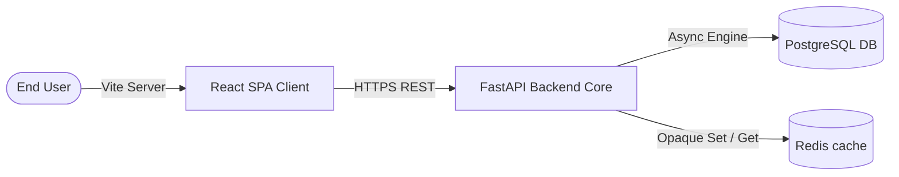
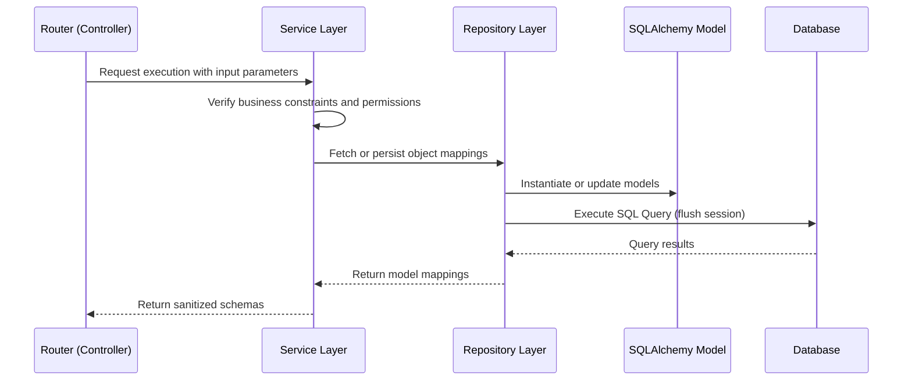

# System Architecture Guide

This document describes the high-level system architecture, data flow, logical layers, and folder layouts for the Akira-PM application.

---

## 1. High-Level Architecture

Akira-PM is structured as a decoupled Single-Page Application (SPA) frontend communicating via a secure REST API with a FastAPI backend:



### Components:
- **Vite React Frontend**: Serves static HTML/JS/CSS assets. Implements dynamic state management and asynchronous data fetching.
- **FastAPI Backend**: Exposes a stateless REST API, enforces authentication, verifies authorization rules (RBAC), and manages DB connections.
- **PostgreSQL Database**: Persistent transaction safety engine. Mapped using SQLAlchemy models.
- **Redis Cache**: Optional storage engine used to cache analytics outputs and manage rate-limiting windows.

---

## 2. Logical Layers (Backend)

The backend code is segregated into clean abstraction layers to decouple database, business, and transportation logic:



1. **Router (API Layer)**: Handles HTTP request parsing, Pydantic validation boundaries, dependencies injection (db, auth, rate limiters), and serializes final JSON envelopes.
2. **Service (Business Layer)**: Coordinates business constraints, validation, security checks, and notification triggering.
3. **Repository (Data Access Layer)**: Encapsulates database query builder statements (SQLAlchemy 2.0 select/insert/update/delete) and handles eager relationship loads to prevent N+1 queries.
4. **Model (Data Layer)**: Defines tables, database fields, constraints, types, and SQLAlchemy relations.

---

## 3. Frontend Architecture

The frontend is structured in a feature-first approach. Feature modules are isolated to simplify maintenance:

```
apps/frontend/src/
├── app/                      # Application bootstrappers, router, query client providers
├── components/               # Shareable UI inputs, buttons, card wrappers
│   ├── common/               # General layouts, modals, alerts
│   └── layout/               # Sidebar, header,Protected/Public Layout components
├── features/                 # Modular capabilities folders
│   ├── auth/                 # Login/Register state, forms, storage
│   ├── projects/             # Project details, creations, updates
│   ├── tasks/                # Kanban task boards, creation drawer, comments
│   └── teams/                # Team lists, invites modal
├── lib/                      # External client instances (Axios setup with interceptors)
├── services/                 # Global API callers
└── types/                    # Common TypeScript type definitions
```

### Core Features Organization:
- **`components/`**: Atomic widgets (e.g., [Button](file:///c:/saas%20project/apps/frontend/src/components/common/PageContainer.tsx)) and global frame items ([Sidebar](file:///c:/saas%20project/apps/frontend/src/components/layout/Sidebar.tsx)).
- **`features/auth/`**: Manages authorization states (tokens), security guards ([ProtectedLayout](file:///c:/saas%20project/apps/frontend/src/components/layout/ProtectedLayout.tsx)), and local token storage.
- **`features/tasks/`**: Implements the drag-and-drop board view, filtering, comments feed, and attachments lists.

---

## 4. Eager Loading & Optimization Strategy

To secure sub-millisecond response rates, the architecture mandates:
- Eager load query options (`selectinload` / `joinedload`) on references that are immediately formatted into nested Pydantic responses.
- Explicit session scopes managing transaction commits on HTTP endpoint resolution to avoid dangling open connections or database locks.
