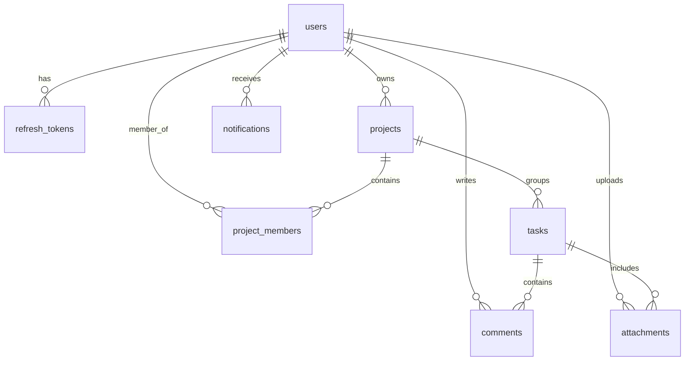

# Database Schema Guide

This document covers Akira-PM schema definitions, indexes, key constraints, and migrations.

---

## 1. Entity-Relationship Diagram (ERD)



---

## 2. Table Schemas

### 1. `users`
Persists core user profile settings and global application role flags.

| Field Name | Data Type | Constraints | Default | Description |
| :--- | :--- | :--- | :--- | :--- |
| `id` | `UUID` | Primary Key | `uuid_generate_v4()` | Unique user identifier. |
| `email` | `VARCHAR(255)` | Unique, Indexed, NOT NULL | | Login email. |
| `hashed_password`| `VARCHAR(255)`| NOT NULL | | bcrypt password hash. |
| `full_name` | `VARCHAR(255)` | Nullable | | Display name. |
| `role` | `VARCHAR(50)` | NOT NULL | `user` | Global privilege role (`admin`, `user`). |
| `is_active` | `BOOLEAN` | NOT NULL | `true` | Status toggle. |
| `is_verified` | `BOOLEAN` | NOT NULL | `false` | Email verification flag. |
| `created_at` | `TIMESTAMP` | NOT NULL | `NOW()` | Timestamp. |

---

### 2. `refresh_tokens`
Used in the secure session token rotation mechanism.

| Field Name | Data Type | Constraints | Default | Description |
| :--- | :--- | :--- | :--- | :--- |
| `id` | `UUID` | Primary Key | `uuid_generate_v4()` | Record identifier. |
| `user_id` | `UUID` | Foreign Key (`users.id` ON DELETE CASCADE), Indexed | | Linked User. |
| `token_hash` | `VARCHAR(255)` | Unique, Indexed, NOT NULL | | SHA-256 hash of refresh token. |
| `expires_at` | `TIMESTAMP` | NOT NULL | | Session expiration. |
| `revoked` | `BOOLEAN` | NOT NULL | `false` | Immediate invalidation flag. |

---

### 3. `projects`
Organizational workspace groups.

| Field Name | Data Type | Constraints | Default | Description |
| :--- | :--- | :--- | :--- | :--- |
| `id` | `UUID` | Primary Key | `uuid_generate_v4()` | Project identifier. |
| `name` | `VARCHAR(255)` | NOT NULL | | Project Title. |
| `description` | `TEXT` | Nullable | | Detail goals. |
| `owner_id` | `UUID` | Foreign Key (`users.id` ON DELETE CASCADE), Indexed | | Owner identifier. |
| `is_archived` | `BOOLEAN` | NOT NULL | `false` | Soft-delete archived toggle. |

---

### 4. `project_members`
Implements project-specific Role-Based Access Control (RBAC).

| Field Name | Data Type | Constraints | Default | Description |
| :--- | :--- | :--- | :--- | :--- |
| `id` | `UUID` | Primary Key | `uuid_generate_v4()` | Record identifier. |
| `project_id` | `UUID` | Foreign Key (`projects.id` ON DELETE CASCADE), Indexed | | Associated project. |
| `user_id` | `UUID` | Foreign Key (`users.id` ON DELETE CASCADE), Indexed | | Member user. |
| `role` | `VARCHAR(50)` | NOT NULL | `developer` | Role: `owner`, `manager`, `developer`, `viewer`. |
| `invited_by` | `UUID` | Foreign Key (`users.id` ON DELETE SET NULL), Indexed | | User who sent the invite. |

* **Composite Constraint**: `uq_project_member` (`project_id`, `user_id`) ensures user cannot have duplicate memberships in the same project.

---

### 5. `tasks`
Individual cards tracked within Kanban views.

| Field Name | Data Type | Constraints | Default | Description |
| :--- | :--- | :--- | :--- | :--- |
| `id` | `UUID` | Primary Key | `uuid_generate_v4()` | Card identifier. |
| `title` | `VARCHAR(255)` | NOT NULL | | Task title. |
| `description` | `TEXT` | Nullable | | Explanatory steps. |
| `status` | `VARCHAR(50)` | NOT NULL, Indexed | `todo` | `todo`, `in_progress`, `in_review`, `done`. |
| `priority` | `VARCHAR(50)` | NOT NULL, Indexed | `medium` | `low`, `medium`, `high`, `critical`. |
| `project_id` | `UUID` | Foreign Key (`projects.id` ON DELETE CASCADE), Indexed | | Core project container. |
| `assignee_id` | `UUID` | Foreign Key (`users.id` ON DELETE SET NULL), Indexed | | Assigned handler. |

---

### 6. `attachments`
Stores file upload metadata. Filenames areUUID-prefixed on disk.

| Field Name | Data Type | Constraints | Default | Description |
| :--- | :--- | :--- | :--- | :--- |
| `id` | `UUID` | Primary Key | `uuid_generate_v4()` | Attachment UUID. |
| `task_id` | `UUID` | Foreign Key (`tasks.id` ON DELETE CASCADE), Indexed | | Target task. |
| `uploaded_by` | `UUID` | Foreign Key (`users.id` ON DELETE CASCADE), Indexed | | Uploader. |
| `filename` | `VARCHAR(255)` | NOT NULL | | Original filename. |
| `file_path` | `VARCHAR(512)` | NOT NULL | | Path to filesystem storage. |
| `mime_type` | `VARCHAR(100)` | NOT NULL | | MIME representation. |
| `file_size` | `INTEGER` | NOT NULL | | Filesize in bytes. |

---

## 3. Database Indexes

- `ix_users_email` (Unique): Fast authentication lookups.
- `ix_refresh_tokens_token_hash` (Unique): Quick session validation on refresh requests.
- `ix_tasks_status` / `ix_tasks_priority`: Optimizes Kanban project board loads.
- `ix_project_members_invited_by`: Optimizes audit history on member invitations.

---

## 4. Alembic Migrations

Database tables are generated using Alembic. Migration files are stored in `apps/backend/alembic/versions/`.

To apply migrations manually:
```bash
cd apps/backend
uv run alembic upgrade head
```

To roll back the last migration:
```bash
uv run alembic downgrade -1
```
