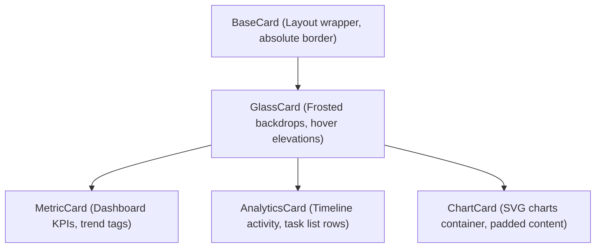

# Akira-PM Design System Reference (v1.2)

This document serves as the single source of truth for the Akira-PM premium visual design language, styling tokens, UI components hierarchy, layout rules, and motion curves.

---

## 1. Visual Theme & Color Palette

The theme is anchored in a luxury fintech aesthetics—featuring matte dark elements, brushed obsidian backdrops, gold primary highlights, and champagne accents.

### Obsidian Core Surface
- **Obsidian Dark**: `#000000` (Main app layout background)
- **Matte Surface**: `#050505` (Base panels, navigations, sidebar)
- **Matte Secondary**: `#0d0d0d` (Input fields, selects, tables background)
- **Glass Frosted Backdrop**: `rgba(10, 10, 10, 0.65)` with `backdrop-filter: blur(16px)`

### Luxury Gold Accents
- **Radiant Gold**: `#d4af37` (`hsl(43, 80%, 54%)`) - Primary action text, focus rings, active indicators.
- **Champagne Light**: `#f5d061` (`hsl(45, 90%, 70%)`) - Subtle headers, tags, indicators.
- **Deep Bronze**: `#ab8836` (`hsl(36, 70%, 40%)`) - Border indicators, inactive badges, gradients.

### Secondary Context Indicators
- **Crimson Red (Destructive)**: `#e11d48` - Critical issues, delete buttons, warning banners.
- **Emerald Green (Success)**: `#10b981` - Complete badges, checkmarks.

---

## 2. Reusable Typography Hierarchy

All typography uses **Inter** with tracking-tight letter spacing and line heights configured for optimal density.

| Level | Size | Weight | Tracking | Leading | Usage |
| :--- | :--- | :--- | :--- | :--- | :--- |
| **Heading XL** | `1.5rem` (24px) | Extrabold (800) | `-0.03em` | `1.2` | Hero headers, Main page stats |
| **Heading L** | `1.125rem` (18px)| Bold (700) | `-0.02em` | `1.3` | Section headings, Drawer headers |
| **Heading M** | `0.875rem` (14px)| Semibold (600) | `-0.015em`| `1.4` | Component titles, card headers |
| **Body** | `0.75rem` (12px) | Medium (500) | `-0.01em` | `1.6` | Paragraph blocks, form fields |
| **Caption** | `0.625rem` (10px)| Semibold (600) | `+0.05em` | `1.5` | Labels, badges, metadata |

---

## 3. Cards Component Hierarchy

To ensure consistency, cards follow a structured inheritance tree.

---

## 4. Reusable Motion Guidelines

Animations are designed to feel snappy and responsive—promoting speed and performance.

### Speed Constraints
- **Hover Transitions**: `150ms` (ease-in-out) - Button scales, dropdown choices.
- **Cards Lift & Glow**: `200ms` (cubic-bezier) - Kanban cards drag start, card hover overlays.
- **Page Transitions**: `250ms` (ease-out) - Route loads.
- **Drawer Panels**: `300ms` (spring) - Slide-out details drawer.
- **Modal Dialogs**: `250ms` (spring) - Dialog center scale.
- **Toasts Popups**: `250ms` (spring) - Bottom indicators.

---

## 5. Storybook-ready component layout

Every component is written in a clean container-presenter structure:
1. **Types**: Props interfaces are explicitly typed in the same file.
2. **Variants**: Use `class-variance-authority` (CVA) for color, scale, and density state properties.
3. **No Context Dependencies**: Outer layouts are passed down as props to ensure components remain modular and easily mountable inside Storybook.
