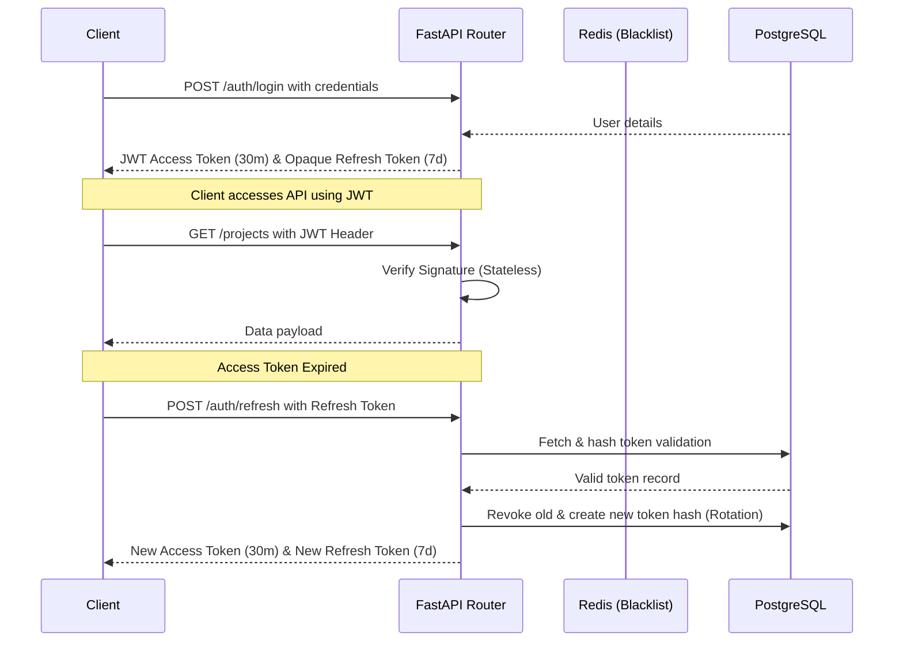

# Security Architecture and Audit Guide

This document describes security controls, credential management, token lifecycles, permissions, and input sanitization policies implemented in Akira-PM.

---

## 1. Authentication & Token Lifecycle

Akira-PM uses a hybrid token authentication strategy designed to maximize session security without introducing high database validation overheads:

1. **Access Tokens**: Short-lived (30 minutes) JSON Web Tokens (JWT) signed via HS256 using `BACKEND_SECRET_KEY`. No database verification is performed, keeping requests lightweight.
2. **Refresh Tokens**: Long-lived (7 days) opaque tokens generated using `secrets.token_urlsafe(64)`. The hash (SHA-256) of the token is saved in the database.
3. **Token Rotation (RTR)**: On every token refresh, the old token is marked as revoked, and a brand-new access/refresh token pair is generated.
4. **Immediate Revocation**: Calling `/auth/logout` sets the `revoked` flag to `true` on the database token record, immediately terminating the session.

---

## 2. Role-Based Access Control (RBAC)

RBAC controls are evaluated within service layer managers.

### Workspace Role Hierarchy
1. **OWNER**: Full administrative privileges over projects, tasks, comments, and members.
   - Demotions: Only the owner can promote another user to `OWNER`.
   - Orphan Prevention: The system prevents deletion of the last owner of a project.
2. **MANAGER**: Project administrative control.
   - Can create projects, tasks, and invite members.
   - Cannot demote/remove the project `OWNER` or invite/remove other `MANAGER` roles.
3. **DEVELOPER**: Standard read/write access.
   - Can update tasks status/priority, write comments, and upload attachments.
   - Cannot manage project settings, invite members, or change roles.
4. **VIEWER**: Read-only access.
   - Can view the boards, check tasks, and read notifications.
   - Cannot write comments, add tasks, upload attachments, or modify project attributes.

---

## 3. Rate Limiting Strategy

To prevent brute force credentials attacks, API endpoints are rate-limited:
- **Scope**: Applied to `/auth/login`, `/auth/register`, `/forgot-password`, `/reset-password`, and `/verify-email`.
- **Implementation**: Uses sliding-window rate tracking. In production, Redis connection pools are utilized (`redis.asyncio`). If Redis is unavailable or unconfigured, the system falls back to an in-memory sliding-window log.
- **Leak Prevention**: To avoid memory exhaustion, the in-memory fallback dynamically deletes empty identifiers and periodically prunes expired logs.

---

## 4. Input & File Upload Validation

- **SQL Injection**: Parameterized SQL queries executed via SQLAlchemy 2.0 prevent injection attacks.
- **Data Serialization**: Strict type and length bounds defined using Pydantic v2 schemas.
- **File Upload Protection**:
  * **Size Bounds**: Enforced 10MB file limit on attachments router.
  * **Directory Traversal Prevention**: Filenames uploaded by clients are sanitized using `os.path.basename()` and prefixed with a unique UUID (`uuid.uuid4()`) when stored.
