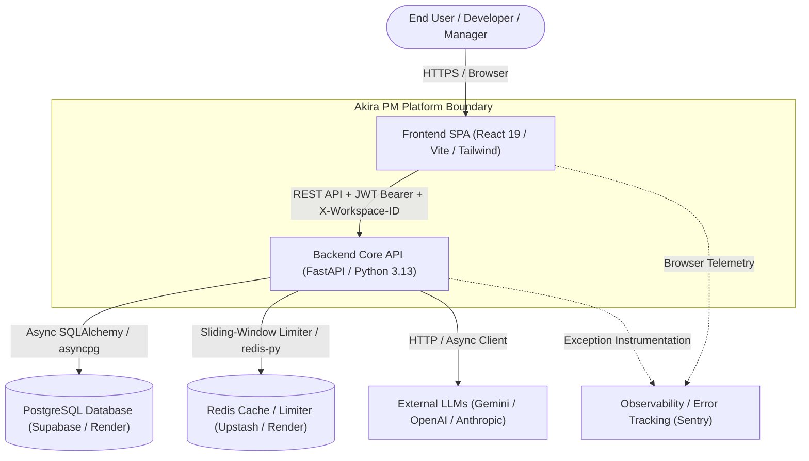
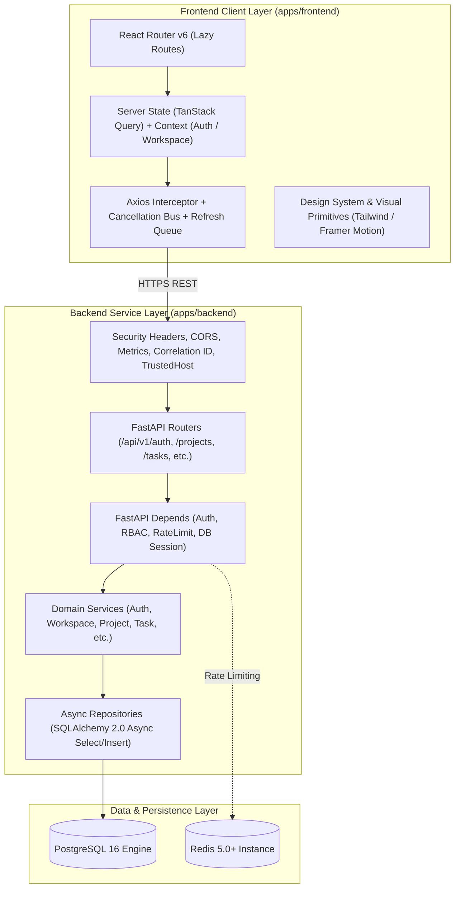
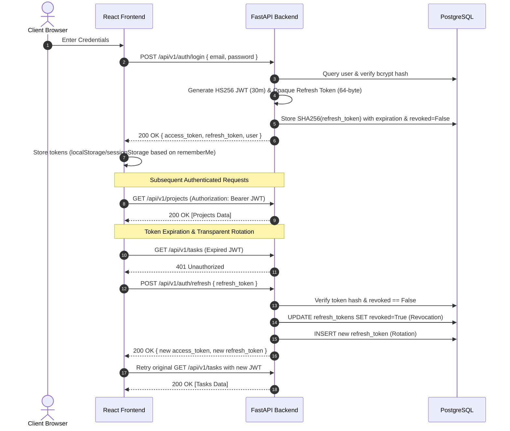
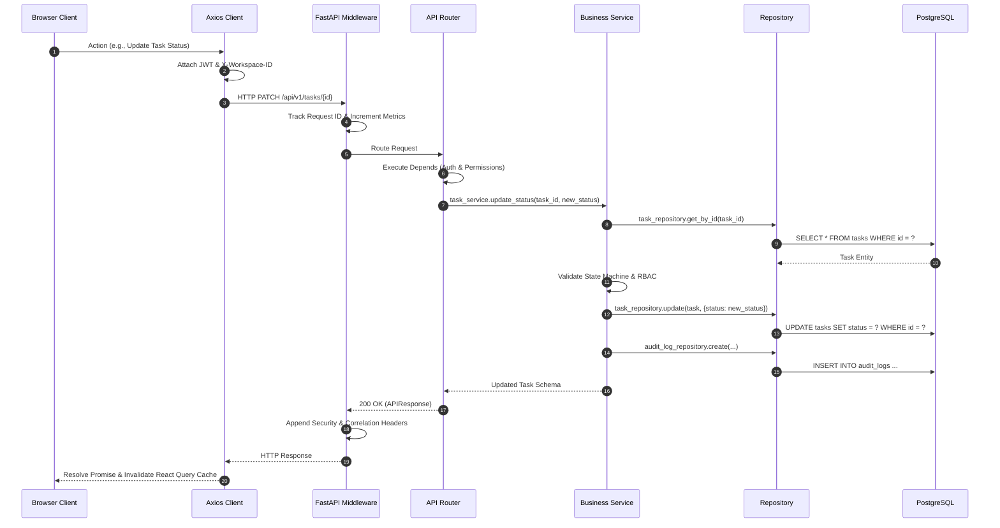

# Akira PM — High-Level Design (HLD)

> **Document Version:** 1.0.0  
> **Status:** Approved / Production  
> **Target Audience:** Staff Software Engineers, Solutions Architects, Technical Leadership

---

## 1. Purpose

This document defines the high-level system architecture for **Akira PM**, a collaborative project management and workspace orchestration platform. It provides an architectural blueprint outlining system boundaries, component topologies, communication protocols, security perimeters, and infrastructure deployment models.

---

## 2. Scope

The scope of this document encompasses:

- The React 19 / Vite Single-Page Application (SPA) client architecture.
- The asynchronous FastAPI ASGI backend service layer.
- Relational persistence via PostgreSQL and caching/rate-limiting via Redis.
- Multi-tier authentication and fine-grained Role-Based Access Control (RBAC).
- Multi-provider AI infrastructure abstractions (OpenAI, Gemini, Anthropic).
- Cloud deployment topology across Vercel (frontend) and Render (backend).
- Continuous Integration and Continuous Deployment (CI/CD) pipelines.

---

## 3. System Goals

### Functional Goals

1. **Multi-Tenant Workspaces**: Isolated organization units supporting project hierarchies, role assignments, and team member management.
2. **Project & Task Orchestration**: Flexible Kanban boards, list views, priority assignments, custom statuses, and task lifecycle tracking.
3. **Collaboration & Activity**: Threaded task discussions, file attachments, and in-app event notifications.
4. **Analytics & Reporting**: Real-time project health telemetry, velocity calculations, and workload distribution metrics.
5. **AI Augmentation**: Pluggable LLM integration for task description generation, summarization, and automation.

### Non-Functional Goals

1. **Performance**: Sub-100ms API response times (p95) for core queries; optimized client-side bundle delivery with code splitting.
2. **Security**: Cryptographic token management with single-use refresh token rotation, strict Content Security Policies (CSP), and automated rate limiting.
3. **High Availability**: Decoupled multi-tier deployment capable of independent scaling and zero-downtime rolling updates.
4. **Maintainability**: Strict layering across Repositories, Services, Schemas, and Controllers with comprehensive automated test suites.

---

## 4. System Context

The following diagram illustrates how external actors and third-party systems interact with the Akira PM boundary:



---

## 5. Architecture Overview

Akira PM adopts a modern, decoupled client-server architecture. The frontend application operates as a Single-Page Application (SPA) compiled into static assets hosted globally on Vercel's Edge CDN. The backend is an asynchronous ASGI service running on Render, exposing versioned RESTful APIs (`/api/v1/*`).

All tenant-scoped requests carry an explicit `X-Workspace-ID` header, which the backend intercepts to dynamically isolate project records, memberships, and operational access.

---

## 6. Architecture Principles

1. **Explicit Separation of Concerns**: Clean isolation between Presentation (React), Transport/API (FastAPI Routers), Business Domain (Services), and Data Access (Repositories).
2. **Zero-Trust Multi-Tenancy**: All workspace data is validated against the authenticated user's workspace membership and role on every database query.
3. **Stateless Service Tier**: The FastAPI application tier maintains no state in memory, delegating session persistence to PostgreSQL and temporary limits to Redis.
4. **Fail-Safe Defaults**: Closed permissions by default; missing tokens or unmatched roles immediately trigger `401 Unauthorized` or `403 Forbidden` exceptions.
5. **Schema-Driven Contracts**: Pydantic v2 schemas strictly validate all incoming payloads and enforce deterministic outgoing response structures (`APIResponse[T]`).

---

## 7. Component Architecture



---

## 8. Deployment Architecture

The production environment is orchestrated across managed cloud providers connected via secure TLS channels:

```mermaid
graph LR
    subgraph Client_Tier ["Client Tier"]
        Browser["User Browser"]
    end

    subgraph Vercel_Platform ["Vercel Edge Network (Frontend)"]
        CDN["Vercel Global CDN Edge"]
        StaticAssets["Static SPA Bundle (dist/index.html, dist/assets/*)"]
    end

    subgraph Render_Platform ["Render Cloud Platform (Backend)"]
        LoadBalancer["Render Load Balancer / SSL Termination"]
        BackendContainer["Docker Container (Python 3.13 / Uvicorn / FastAPI)"]
    end

    subgraph Cloud_Databases ["Managed Cloud Persistence"]
        PostgresDB[("Supabase / Render Managed PostgreSQL")]
        UpstashRedis[("Upstash / Render Managed Redis")]
    end

    Browser -->|HTTPS| CDN
    CDN --> StaticAssets
    Browser -->|REST API Calls| LoadBalancer
    LoadBalancer --> BackendContainer
    BackendContainer -->|Async TCP 5432 (SSL)| PostgresDB
    BackendContainer -->|Async TLS 6379| UpstashRedis
```

---

## 9. Data Architecture

The data architecture utilizes PostgreSQL with strictly enforced foreign key relationships, composite indexing on high-traffic lookup paths, and Alembic database migrations.

### Key Entities

- **Users & Auth**: `User` (identity and global role), `RefreshToken` (SHA-256 hashed token with revocation flags), `AuditLog` (immutable action trail).
- **Tenant Hierarchy**: `Workspace` $\rightarrow$ `WorkspaceMember` $\rightarrow$ `Project` $\rightarrow$ `ProjectMember` $\rightarrow$ `Task`.
- **Task Collaboration**: `Task` $\rightarrow$ `Comment`, `Attachment`.
- **User Engagement**: `Notification` (typed user notifications).

For detailed schemas, ERDs, and index strategies, consult [Database Documentation](../database/DATABASE.md).

---

## 10. Authentication Architecture

Akira PM implements a hybrid token strategy combining short-lived JSON Web Tokens (JWT) for stateless authorization with single-use opaque refresh tokens for session rotation.



---

## 11. Security Architecture

1. **Transport Layer**: Strict HTTPS enforcement across all endpoints.
2. **Defensive Headers**:
   - `Content-Security-Policy`: Restricts resource injection; disables frame-ancestors.
   - `Strict-Transport-Security` (HSTS): Enforces 2-year SSL pinning (`max-age=63072000; includeSubDomains; preload`).
   - `X-Frame-Options: DENY`: Prevents clickjacking attacks.
   - `X-Content-Type-Options: nosniff`: Prevents MIME-type sniffing.
3. **Rate Limiting**: Sliding window tracking by endpoint and client IP via Redis (with an in-memory fallback), throttling burst traffic and brute-force attempts.
4. **SQL Injection Defense**: 100% parameterized async queries through SQLAlchemy 2.0 ORM.
5. **Host Header Protection**: `TrustedHostMiddleware` enforces validated domain white-lists in production environments.

For a comprehensive threat model and compliance review, see [Security Documentation](../security/SECURITY.md).

---

## 12. API Architecture

All endpoints are versioned under `/api/v1/` and return standardized JSON envelopes:

```json
{
  "success": true,
  "data": { ... },
  "error": null,
  "meta": {
    "timestamp": "2026-08-16T16:00:00Z"
  }
}
```

### Core Sub-Routers

- `/api/v1/health`: System liveness and dependency readiness probes.
- `/api/v1/auth`: Registration, session login, refresh rotation, and profile queries.
- `/api/v1/workspaces`: Multi-tenant organization and member management.
- `/api/v1/projects`: Project lifecycle management and workspace assignment.
- `/api/v1/tasks`: Task CRUD, Kanban status transitions, and assignee filtering.
- `/api/v1/project-members`: Granular project-level access control.
- `/api/v1/comments`: Task-level discussion threads.
- `/api/v1/attachments`: File upload metadata and tracking.
- `/api/v1/notifications`: In-app notification delivery and read status.
- `/api/v1/dashboard`: High-level velocity metrics and operational KPI rollups.
- `/api/v1/search`: Cross-entity global search across projects, tasks, and members.
- `/api/v1/ai`: Multi-provider LLM health checks and generation infrastructure.

---

## 13. Frontend Architecture

- **SPA Foundation**: React 19 single-page application built on Vite 6 and TypeScript 5.6.
- **Route Splitting**: Dynamic chunking using `React.lazy` and `React.Suspense` prevents large initial bundle downloads.
- **Client Networking (`src/lib/axios.ts`)**:
  - Global `AbortController` request cancellation bus triggered upon route transitions or logout.
  - Automatic `X-Workspace-ID` header injection from active workspace state.
  - Transparent mutex-guarded refresh queue retrying queued requests upon token expiration.
- **Visual Design System**: Obsidian Black and Akira Vermilion theme palette with hardware-accelerated Framer Motion transitions and reduced-motion accessibility overrides.

---

## 14. Backend Architecture

- **Runtime**: Python 3.12+ (tested up to Python 3.14) running on Uvicorn with `uv` package management.
- **Lifecycle Hooks (`src/main.py`)**: `lifespan` context manager initializing connection pools on startup and cleanly disconnecting on SIGTERM.
- **Dependency Injection**: FastAPI `Depends` injection for database sessions (`AsyncSession`), authenticated user resolution (`get_current_active_user`), and workspace role checks (`check_workspace_role`).
- **Data Access Pattern**: Repository pattern decoupling query execution from service business rules.

---

## 15. External Integrations

1. **Sentry SDK**: Real-time frontend and backend exception tracking and distributed tracing.
2. **Multi-Provider LLM Tier**: Configurable AI routing across Google Gemini, OpenAI, and Anthropic APIs.
3. **Managed PostgreSQL (Supabase / Render)**: Enterprise ACID persistence.
4. **Managed Redis (Upstash / Render)**: Distributed rate limiting and session caching.

---

## 16. Data Flow & Request Lifecycle



---

## 17. Scalability Considerations

1. **Horizontal Backend Scaling**: The stateless FastAPI container can scale horizontally behind Render's load balancer without session stickiness requirements.
2. **Connection Pooling**: `asyncpg` connection pools prevent database connection exhaustion under high concurrency.
3. **Static Edge Distribution**: Frontend static bundles are distributed globally across Vercel Edge nodes, reducing backend load to pure API payloads.
4. **Database Indexing**: Composite indexes on `(workspace_id, status)` and `(project_id, assignee_id)` prevent full table scans.

---

## 18. Reliability Considerations

1. **Automated Migrations on Startup**: Container startup executes `alembic upgrade head` before binding the Uvicorn listener, ensuring database schemas match running code.
2. **Deep Health Probes**:
   - `/health`: Liveness verification.
   - `/ready`: Deep probe verifying active database queries (`SELECT 1`) and Redis pings before routing traffic.
3. **Graceful Degraded Modes**: Rate limiter automatically falls back to an in-memory sliding window if Redis is temporarily unreachable.

---

## 19. Observability

1. **Prometheus Metrics (`/metrics`)**: Exposes uptime duration, total request counts, and HTTP error counters.
2. **Distributed Tracing**: `X-Request-ID` and `X-Correlation-ID` headers are generated per request and propagated across logs and response headers.
3. **Structured Logging**: Standardized Python logging formatting correlation IDs and contextual metadata.

---

## 20. Disaster Recovery Considerations

1. **Automated Point-in-Time Recovery**: Daily automated database snapshots managed by the cloud PostgreSQL provider (Supabase / Render).
2. **Reproducible Infrastructure**: Multi-stage Dockerfiles and environment-driven configurations allow recreation of application tiers in any standard container runtime.

---

## 21. Future Evolution

- **Real-Time Collaboration**: Transition notification and task activity pipelines to WebSockets / Server-Sent Events (SSE).
- **Object Storage Adapter**: Transition task file attachments to Amazon S3 / Cloudflare R2 object storage.
- **Enterprise SSO**: SAML 2.0 and OAuth2 OpenID Connect integration for Google Workspace and GitHub organizations.
- **Granular Webhooks**: Outbound event webhook subscriptions for CI/CD integrations.
