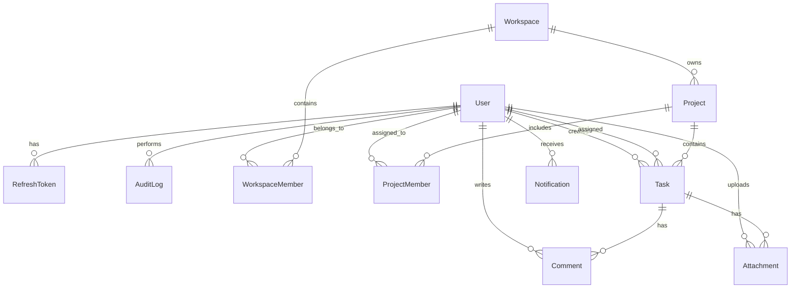
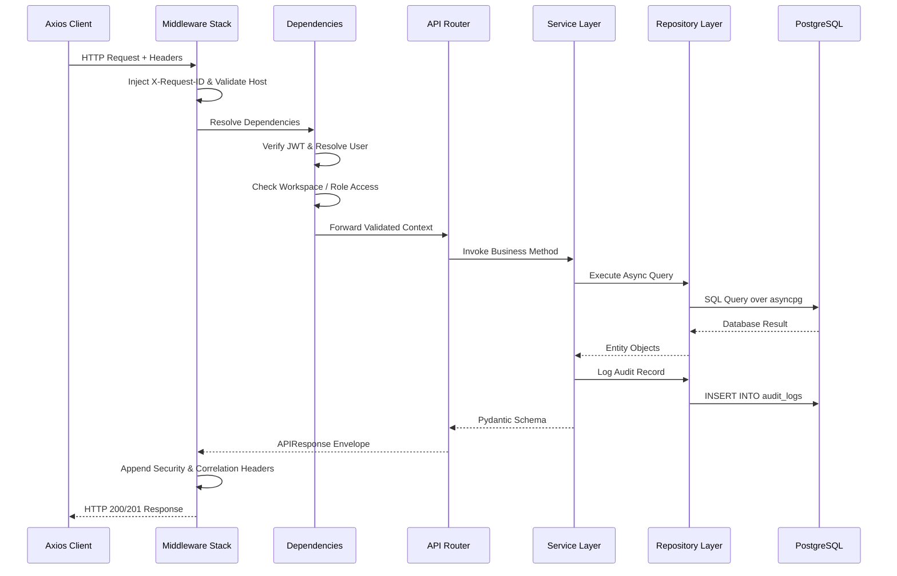

# Akira PM — Low-Level Design (LLD)

> **Document Version:** 1.0.0  
> **Status:** Approved / Production  
> **Target Audience:** Core Contributors, Backend & Frontend Engineers, Security Reviewers

---

## 1. Purpose

This document provides a comprehensive, low-level technical specification of the **Akira PM** codebase. It documents package layouts, class hierarchies, dependency injection bindings, schema definitions, database constraints, authentication internals, and error propagation mechanics.

---

## 2. Repository Structure

```
Akira_PM/
├── .github/
│   ├── scripts/quality_gate.py         # Automated repository sanity & hygiene checker
│   └── workflows/                      # CI, Deployment, Docker, Release, Security workflows
├── apps/
│   ├── backend/
│   │   ├── alembic/                    # Database migration environment (11 revisions)
│   │   │   └── versions/               # 001_create_auth_tables -> 7a0a8cd7172f (head)
│   │   ├── src/
│   │   │   ├── ai/                     # Multi-provider LLM abstraction (OpenAI, Gemini, Anthropic)
│   │   │   ├── api/v1/                 # 14 domain sub-routers registered under /api/v1
│   │   │   ├── core/                   # Engine, settings, security, logging, exceptions, redis
│   │   │   ├── dependencies/           # FastAPI Depends (auth, permissions, db, rate_limit)
│   │   │   ├── models/                 # 11 Declarative SQLAlchemy async models
│   │   │   ├── repositories/           # Async database access layer
│   │   │   ├── schemas/                # Pydantic v2 validation and serialization schemas
│   │   │   ├── services/               # Core business logic and orchestration
│   │   │   └── main.py                 # FastAPI app, lifespan, middlewares, handlers
│   │   ├── tests/                      # Pytest suite (59 test cases)
│   │   ├── Dockerfile                  # Production multi-stage runner
│   │   └── pyproject.toml              # uv package management and linter configurations
│   └── frontend/
│       ├── src/
│       │   ├── app/                    # router.tsx, query-provider.tsx, providers.tsx, App.tsx
│       │   ├── components/             # Reusable UI primitives, layouts, feedback toasts
│       │   ├── context/                # Global contexts (WorkspaceContext, etc.)
│       │   ├── features/               # Feature domain modules (auth, tasks, projects, etc.)
│       │   ├── lib/                    # axios.ts (cancellation, refresh queue, workspace interceptor)
│       │   ├── services/api/           # Type-safe Axios API client wrappers
│       │   └── theme/                  # Design tokens, motion settings, color palettes
│       ├── Dockerfile                  # Multi-stage Nginx runner
│       ├── vercel.json                 # Vercel SPA routing and security header configuration
│       └── package.json                # Dependencies, scripts, linting definitions
├── docs/                               # HLD, LLD, Database, Deployment, Security, Contributing
├── docker-compose.yml                  # Local development multi-container orchestration
├── package.json                        # Root workspace configuration
└── pnpm-lock.yaml                      # Root dependency lockfile (pnpm 11.15.0)
```

---

## 3. Frontend Module Design

The frontend is structured into isolated domain feature modules located under `apps/frontend/src/features/`:

| Module            | Location                      | Responsibilities                                                                                                                |
| :---------------- | :---------------------------- | :------------------------------------------------------------------------------------------------------------------------------ |
| **Auth**          | `src/features/auth/`          | `LoginPage`, `RegisterPage`, `ForgotPasswordPage`, `ResetPasswordPage`, `EmailVerificationPage`, `AuthProvider`, `authStorage`. |
| **Workspaces**    | `src/features/workspaces/`    | Workspace selector, member management, invitation dialogs, context switching.                                                   |
| **Projects**      | `src/features/projects/`      | `ProjectsListPage`, `ProjectDetailsPage`, project creation, member assignment.                                                  |
| **Tasks**         | `src/features/tasks/`         | `TasksListPage`, Kanban Board, List View, Task Drawer, status drag-and-drop.                                                    |
| **Dashboard**     | `src/features/dashboard/`     | `DashboardPage`, velocity charts, completion metrics, task distribution.                                                        |
| **Teams**         | `src/features/teams/`         | `TeamsPage`, organization roster, role allocation, member permissions.                                                          |
| **Search**        | `src/features/search/`        | `SearchModal` (Global shortcut `Cmd+K` / `Ctrl+K`), cross-entity search indexing.                                               |
| **Notifications** | `src/features/notifications/` | Notification bell, read/unread state tracking, event dispatching.                                                               |
| **Reports**       | `src/features/reports/`       | Project status distribution, member velocity analytics.                                                                         |
| **Calendar**      | `src/features/calendar/`      | Timeline and date-based scheduling views.                                                                                       |
| **Settings**      | `src/features/settings/`      | Profile management, password reset, security preferences.                                                                       |
| **Marketing**     | `src/features/marketing/`     | `HomePage`, `FeaturesPage`, `PricingPage`, `AboutPage`, `TermsPage`, `PrivacyPage`.                                             |

---

## 4. Backend Module Design

The backend enforces a clean 4-tier layered architecture:

```
[ HTTP Request ]
       │
       ▼
┌─────────────────────────────────────────┐
│ 1. API Layer (src/api/v1/)              │  <-- Routing, HTTP validation, status codes
└─────────────────────────────────────────┘
       │
       ▼
┌─────────────────────────────────────────┐
│ 2. Service Layer (src/services/)        │  <-- Business logic, audit logs, authorization
└─────────────────────────────────────────┘
       │
       ▼
┌─────────────────────────────────────────┐
│ 3. Repository Layer (src/repositories/) │  <-- Async SQLAlchemy queries, joins, filters
└─────────────────────────────────────────┘
       │
       ▼
┌─────────────────────────────────────────┐
│ 4. Data Layer (src/models/ & PostgreSQL)│  <-- Database schema, constraints, relations
└─────────────────────────────────────────┘
```

---

## 5. API Layer

The API layer is versioned under `/api/v1` and managed by `src/api/v1/router.py`. All responses conform to the generic `APIResponse[T]` Pydantic envelope:

```python
# src/schemas/response.py
class APIResponse(BaseModel, Generic[DataT]):
    success: bool = True
    data: DataT | None = None
    error: ErrorDetail | None = None
    meta: dict[str, Any] = Field(default_factory=lambda: {"timestamp": datetime.now(UTC).isoformat()})
```

---

## 6. Router Design

Sub-routers are mounted in `src/api/v1/router.py` with explicit tags and path prefixes:

```python
api_router = APIRouter()

api_router.include_router(health_router, prefix="/health", tags=["Health Checks"])
api_router.include_router(auth_router, prefix="/auth", tags=["Authentication"])
api_router.include_router(workspaces_router, prefix="/workspaces", tags=["Workspaces"])
api_router.include_router(project_router, prefix="/projects", tags=["Projects"])
api_router.include_router(task_router, prefix="/tasks", tags=["Tasks"])
api_router.include_router(project_member_router, prefix="/project-members", tags=["Project Members"])
api_router.include_router(comments_router, prefix="/comments", tags=["Comments"])
api_router.include_router(attachments_router, prefix="/attachments", tags=["Attachments"])
api_router.include_router(notifications_router, prefix="/notifications", tags=["Notifications"])
api_router.include_router(dashboard_router, prefix="/dashboard", tags=["Dashboard"])
api_router.include_router(search_router, prefix="/search", tags=["Search"])
api_router.include_router(audit_log_router, prefix="/audit-logs", tags=["Audit Logs"])
api_router.include_router(users_router, prefix="/users", tags=["Users"])
api_router.include_router(ai_router, prefix="/ai", tags=["AI Infrastructure"])
```

---

## 7. Service Layer

Services encapsulate all business workflows and side effects (such as audit logging and notification creation):

| Service Class         | Location                               | Core Responsibilities                                                                            |
| :-------------------- | :------------------------------------- | :----------------------------------------------------------------------------------------------- |
| `AuthService`         | `src/services/auth_service.py`         | User registration, password verification, token generation, single-use refresh rotation, logout. |
| `WorkspaceService`    | `src/services/workspace_service.py`    | Workspace lifecycle, member invites, role transitions, context resolution.                       |
| `ProjectService`      | `src/services/project_service.py`      | Project creation, workspace scoping, access permissions, status tracking.                        |
| `TaskService`         | `src/services/task_service.py`         | Task creation, status updates, priority modification, assignee verification.                     |
| `CommentService`      | `src/services/comment_service.py`      | Threaded comment management, task association.                                                   |
| `NotificationService` | `src/services/notification_service.py` | Typed notification dispatching and unread queries.                                               |
| `DashboardService`    | `src/services/dashboard_service.py`    | Aggregated analytics, velocity calculations, completion rates.                                   |
| `SearchService`       | `src/services/search_service.py`       | Multi-table cross-entity search indexing.                                                        |
| `AIService`           | `src/ai/services/ai.py`                | Multi-provider LLM routing, fallback handling, token usage estimation.                           |

---

## 8. Repository Layer

Repositories decouple SQLAlchemy query formulation from business services:

- `UserRepository` (`src/repositories/user_repository.py`)
- `RefreshTokenRepository` (`src/repositories/refresh_token_repository.py`)
- `WorkspaceRepository` (`src/repositories/workspace_repository.py`)
- `WorkspaceMemberRepository` (`src/repositories/workspace_member_repository.py`)
- `ProjectRepository` (`src/repositories/project_repository.py`)
- `ProjectMemberRepository` (`src/repositories/project_member_repository.py`)
- `TaskRepository` (`src/repositories/task_repository.py`)
- `CommentRepository` (`src/repositories/comment_repository.py`)
- `AttachmentRepository` (`src/repositories/attachment_repository.py`)
- `NotificationRepository` (`src/repositories/notification_repository.py`)
- `AuditLogRepository` (`src/repositories/audit_log_repository.py`)

All repositories leverage asynchronous SQLAlchemy execution (`await self.db.execute(statement)`).

---

## 9. Schema Design

All DTOs (Data Transfer Objects) are defined using Pydantic v2 with strict type validations:

```python
# User Registration Schema
class UserRegister(BaseModel):
    email: EmailStr
    password: str = Field(..., min_length=8)
    full_name: str = Field(..., min_length=1, max_length=100)

# Token Response Schema
class TokenResponse(BaseModel):
    access_token: str
    refresh_token: str
    token_type: str = "bearer"
    user: UserResponse

# Task Create Schema
class TaskCreate(BaseModel):
    title: str = Field(..., min_length=1, max_length=200)
    description: str | None = None
    status: TaskStatus = TaskStatus.TODO
    priority: TaskPriority = TaskPriority.MEDIUM
    project_id: UUID
    assignee_id: UUID | None = None
    due_date: datetime | None = None
```

---

## 10. Database Model Design



### Table Definitions

1. `users`: UUID primary key, unique lowercase email, bcrypt hashed password, full name, role (`admin`/`user`), active/verified booleans.
2. `refresh_tokens`: UUID primary key, user foreign key, SHA-256 token hash, timezone-aware `expires_at`, `revoked` boolean.
3. `workspaces`: UUID primary key, name, slug, owner foreign key.
4. `workspace_members`: Workspace foreign key, user foreign key, role (`owner`/`admin`/`manager`/`developer`/`viewer`), unique constraint `(workspace_id, user_id)`.
5. `projects`: UUID primary key, workspace foreign key, owner foreign key, name, description, status, key.
6. `project_members`: Project foreign key, user foreign key, role (`owner`/`manager`/`developer`/`viewer`).
7. `tasks`: UUID primary key, project foreign key, creator foreign key, assignee foreign key, title, description, status (`todo`/`in_progress`/`in_review`/`done`/`cancelled`), priority (`low`/`medium`/`high`/`urgent`), due date.
8. `comments`: UUID primary key, task foreign key, author foreign key, content text, timestamps.
9. `attachments`: UUID primary key, task foreign key, uploader foreign key, filename, file size, content type, storage path.
10. `notifications`: UUID primary key, user foreign key, title, message, type, read boolean.
11. `audit_logs`: UUID primary key, user foreign key, action string, entity type, entity ID, metadata JSON, timestamp.

---

## 11. Authentication Internals

### JWT Access Token (`src/core/security.py`)

- **Algorithm**: `HS256`
- **Signing Key**: `settings.BACKEND_SECRET_KEY`
- **Claims**:
  - `sub`: User UUID string
  - `email`: User email string
  - `role`: User global role string
  - `jti`: Unique UUIDv4 token identifier
  - `type`: `"access"`
  - `exp`: Expiration timestamp (30 minutes default)

### Refresh Token Rotation (`src/services/auth_service.py`)

- **Generation**: `secrets.token_urlsafe(64)` producing 86 cryptographically random ASCII characters.
- **Hashing**: `hashlib.sha256(raw_token.encode("utf-8")).hexdigest()`.
- **Rotation Enforcement**: When `/api/v1/auth/refresh` receives a raw refresh token:
  1. Hashes incoming token and queries `refresh_tokens`.
  2. If token is not found or `revoked == True`, raises `401 Unauthorized`.
  3. Validates `expires_at > datetime.now(UTC)`.
  4. Marks current token `revoked = True`.
  5. Issues a new JWT access token and a brand new refresh token saved in the database.

---

## 12. Authorization & RBAC

Role checks are managed in `src/dependencies/permissions.py`:

### Workspace Roles & Capabilities

| Workspace Role | Project Create/Delete | Task Create/Edit All |  Task Edit Assigned  | View Only |
| :------------- | :-------------------: | :------------------: | :------------------: | :-------: |
| **Owner**      |          Yes          |         Yes          |         Yes          |    Yes    |
| **Admin**      |          Yes          |         Yes          |         Yes          |    Yes    |
| **Manager**    |    If Member/Owner    |   If Member/Owner    |         Yes          |    Yes    |
| **Developer**  |          No           |          No          | Status/Priority Only |    Yes    |
| **Viewer**     |          No           |          No          |          No          | Read Only |

### Permission Dependency Examples

```python
# Enforce workspace owner or admin role
@router.post("/workspaces/{id}/invite", dependencies=[Depends(check_workspace_role(["owner", "admin"]))])
async def invite_member(...): ...

# Enforce task edit permissions
@router.patch("/tasks/{id}")
async def update_task(id: UUID, data: TaskUpdate, current_user: User = Depends(get_current_active_user), db: AsyncSession = Depends(get_db_session)):
    task = await task_repo.get_by_id(id)
    await check_task_write_permission(task, current_user.id, db)
    return await task_service.update_task(task, data)
```

---

## 13. Error Handling

Errors follow a standardized hierarchy mapped to HTTP status codes:

```
AppException (Base, 500)
├── ValidationException (400)
├── UnauthorizedException (401)
├── ForbiddenException (403)
├── NotFoundException (404)
├── ConflictException (409)
└── RateLimitException (429)
```

### Global Handlers (`src/core/handlers.py`)

1. `app_exception_handler`: Intercepts `AppException` and returns `{ "success": false, "error": { "code": "...", "message": "..." } }`.
2. `validation_exception_handler`: Formats Pydantic `RequestValidationError` into readable field-level errors.
3. `general_exception_handler`: Catches unhandled exceptions, logs backtraces to Sentry, and returns safe 500 responses without leaking internal stack traces.

---

## 14. Validation

- **Client Validation**: Zod schemas executed via `react-hook-form` resolvers.
- **API Payload Validation**: Pydantic v2 schemas validating email formats, password complexities, string lengths, and UUID structures.
- **Business Rule Validation**: Service layer assertions validating state transitions (e.g. task cannot move to `done` if blocked by unresolved parent constraints).

---

## 15. Middleware Pipeline

Registered in `src/main.py` in exact execution order:

1. **`TrustedHostMiddleware`**: Enforces allowed domain hosts in production.
2. **`CORSMiddleware`**: Controls origin allowances, method permissions, and credentials support.
3. **`GZipMiddleware`**: Compresses responses over 1,000 bytes.
4. **`request_id_and_metrics_middleware`**: Injects correlation IDs into `contextvars` and records Prometheus metrics.
5. **`add_security_headers`**: Attaches defensive HTTP response headers (CSP, HSTS, X-Frame-Options, etc.).

---

## 16. API Client Architecture (`src/lib/axios.ts`)

- **Base URL**: Dynamically resolved via `import.meta.env.VITE_API_URL` (fallback `http://localhost:8000/api/v1`).
- **Request Interceptor**:
  - Automatically creates and binds an `AbortController` signal.
  - Injects `Authorization: Bearer <token>` from `authStorage`.
  - Injects `X-Workspace-ID` from `localStorage`.
- **Response Interceptor**:
  - Automatically unwraps `{ success: true, data: T }` envelopes to return `data` directly to callers.
  - Implements a mutex-locked refresh queue on 401 status: pauses concurrent requests, calls `/auth/refresh`, updates tokens, and replays failed requests.

---

## 17. State Management

- **Server State**: `@tanstack/react-query` manages API data fetching, caching, deduplication, and background refetching.
- **Cache Invalidation**:
  - Mutations automatically trigger targeted cache key invalidation: `queryClient.invalidateQueries({ queryKey: ["tasks"] })`.
- **Client Session Context**: `AuthContext` provides global user profile, authentication status (`Loading`, `Authenticated`, `Unauthenticated`, `Expired`), and login/logout functions.

---

## 18. Request/Response Lifecycle



---

## 19. Database Migration Strategy

- **Tooling**: Alembic wired to SQLAlchemy Async engine (`apps/backend/alembic/env.py`).
- **Execution**: Automated execution on container startup via `alembic upgrade head` before Uvicorn starts.
- **Migration Sequence**:
  - `001_create_auth_tables`: Base users and refresh tokens.
  - `002_create_audit_logs`: Immutable audit logging.
  - `e3d29a502efc_create_workspaces`: Multi-tenant workspaces and memberships.
  - `96d52dd28443_create_projects`: Project containers.
  - `358a06ce1e01_create_tasks`: Task entities and priorities.
  - `aff209e05cb7_create_project_members`: Project-level permissions.
  - `1f8ec3da9184_create_comments`: Task comments.
  - `a0a8cd71722f_create_notifications`: In-app notification engine.
  - `ad2717ca52db_create_attachments`: Attachment metadata.
  - `f0a8cd71723a_add_performance_indexes`: Composite indexes on lookup paths.
  - `7a0a8cd7172f_add_missing_user_columns`: Extended profile fields (**Head**).

---

## 20. Background Processing

- Lifespan tasks manage Redis connection pools and connection keep-alives.
- Asynchronous database operations leverage non-blocking asyncpg event loops without blocking worker threads.

---

## 21. Caching & Rate Limiting

- **Redis Cache Manager (`src/core/redis.py`)**: `RedisCache` singleton providing connection pooling via `redis.asyncio`.
- **Sliding-Window Rate Limiting (`src/dependencies/rate_limit.py`)**:
  - Atomic Redis pipeline: `INCR` + `EXPIRE` window.
  - In-memory fallback tracking sliding-window timestamps with probabilistic garbage collection.

---

## 22. File Storage

- `AttachmentService` (`src/services/attachment_service.py`) manages file uploads, records MIME types, calculates file sizes, and writes to dedicated storage directories with metadata persisted in the `attachments` table.

---

## 23. Notification System

- `NotificationService` (`src/services/notification_service.py`) provides typed notifications (`task_assigned`, `comment_added`, `project_invited`).
- Endpoints allow fetching unread counts, marking individual notifications as read, and bulk mark-as-read.

---

## 24. Testing Architecture

- **Backend (`apps/backend/tests/`)**:
  - Framework: Pytest 8.2.2 + `pytest-asyncio` + `pytest-cov`.
  - In-memory test isolation with SQLite / async mock drivers (`conftest.py`).
  - Total test suite: 59 passed tests covering auth, RBAC, projects, tasks, dashboard, notifications, search, AI, and health.
- **Frontend (`apps/frontend/`)**:
  - Framework: Vitest 2.1.8 + `@testing-library/react`.
  - Total test suite: 19 passed tests covering auth hooks, auth storage, axios interceptors, task lists, and drawer sections.

---

## 25. Security Implementation

- Password hashing using `bcrypt.hashpw` with cryptographically generated salts.
- Replay attack mitigation via single-use refresh token rotation.
- Prevention of JWT secret key reuse with startup validation in `src/core/settings.py`.
- Automated rate limiting on sensitive routes (auth, login, password recovery).

---

## 26. Deployment Runtime

- **Backend**: Python 3.13-slim multi-stage container on Render running non-root user `appuser` (UID 8888).
- **Frontend**: Single-Page Application deployed to Vercel with SPA wildcard fallback rewrites (`apps/frontend/vercel.json`).

---

## 27. Failure Scenarios & Mitigations

| Failure Mode                  | Impact                   | Mitigation Strategy                                                                               |
| :---------------------------- | :----------------------- | :------------------------------------------------------------------------------------------------ |
| **PostgreSQL Unreachable**    | API requests fail        | Deep readiness probe (`/ready`) returns 503; Render stops routing traffic to unhealthy instances. |
| **Redis Unreachable**         | Rate limiting impacted   | Automatic fallback to in-memory sliding-window limiter; warnings logged.                          |
| **Expired JWT Token**         | Request returns 401      | Axios interceptor transparently refreshes tokens using the refresh queue and replays request.     |
| **Invalid Workspace Context** | Unauthorized data access | Backend checks workspace membership before executing any query; raises 403 Forbidden.             |

---

## 28. Extension Points

1. **Pluggable AI Providers**: `AIProvider` base class allows adding new models (e.g. Mistral, Local Llama) under `src/ai/providers/`.
2. **Custom Notification Channels**: Notification service can be extended with webhook or email adapters (e.g. Resend / SendGrid).
3. **Storage Backends**: Attachment repository interface can be adapted to Amazon S3, Google Cloud Storage, or Cloudflare R2.
