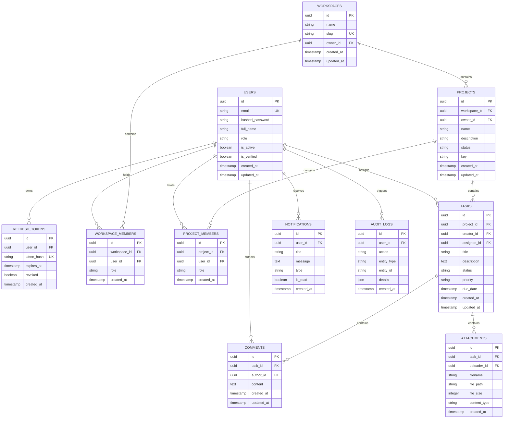

# Database Architecture & Migration Reference — Akira PM

> **Document Version:** 1.0.0  
> **Status:** Production Reference

---

## 1. Overview

Akira PM uses **PostgreSQL 16** managed via asynchronous SQLAlchemy 2.0 ORM (`asyncpg` driver) and **Alembic** migration tracking.

### Key Characteristics

- **UUID Primary Keys**: All entities utilize `uuid.uuid4` identifiers to prevent enumeration attacks and simplify distributed replication.
- **Asynchronous Execution**: All queries are executed non-blockingly using `await session.execute(...)`.
- **Composite Indexing**: Optimized lookup paths on high-frequency tenant queries (`workspace_id`, `project_id`, `assignee_id`).
- **Referential Integrity**: Foreign keys with `ON DELETE CASCADE` where child entities belong exclusively to a parent container (e.g. comments $\rightarrow$ task).

---

## 2. Entity Relationship Diagram (ERD)



---

## 3. Migration History & Timeline

Migrations are located in `apps/backend/alembic/versions/` and versioned chronologically:

| Migration Revision | Name / Description         | Entities Affected                             |
| :----------------- | :------------------------- | :-------------------------------------------- |
| `001`              | `create_auth_tables`       | `users`, `refresh_tokens`                     |
| `002`              | `create_audit_logs`        | `audit_logs`                                  |
| `e3d29a502efc`     | `create_workspaces`        | `workspaces`, `workspace_members`             |
| `96d52dd28443`     | `create_projects`          | `projects`                                    |
| `358a06ce1e01`     | `create_tasks`             | `tasks`                                       |
| `aff209e05cb7`     | `create_project_members`   | `project_members`                             |
| `1f8ec3da9184`     | `create_comments`          | `comments`                                    |
| `a0a8cd71722f`     | `create_notifications`     | `notifications`                               |
| `ad2717ca52db`     | `create_attachments`       | `attachments`                                 |
| `f0a8cd71723a`     | `add_performance_indexes`  | Composite performance indexes on foreign keys |
| `7a0a8cd7172f`     | `add_missing_user_columns` | Extended profile metadata (**HEAD**)          |

---

## 4. Migration Commands

To manage database revisions locally:

```bash
# Apply all pending migrations to head
cd apps/backend
ENV_STATE=development uv run alembic upgrade head

# Generate a new autodetected migration
ENV_STATE=development uv run alembic revision --autogenerate -m "describe_changes"

# Rollback the last applied migration
ENV_STATE=development uv run alembic downgrade -1

# Show current database revision
ENV_STATE=development uv run alembic current
```
