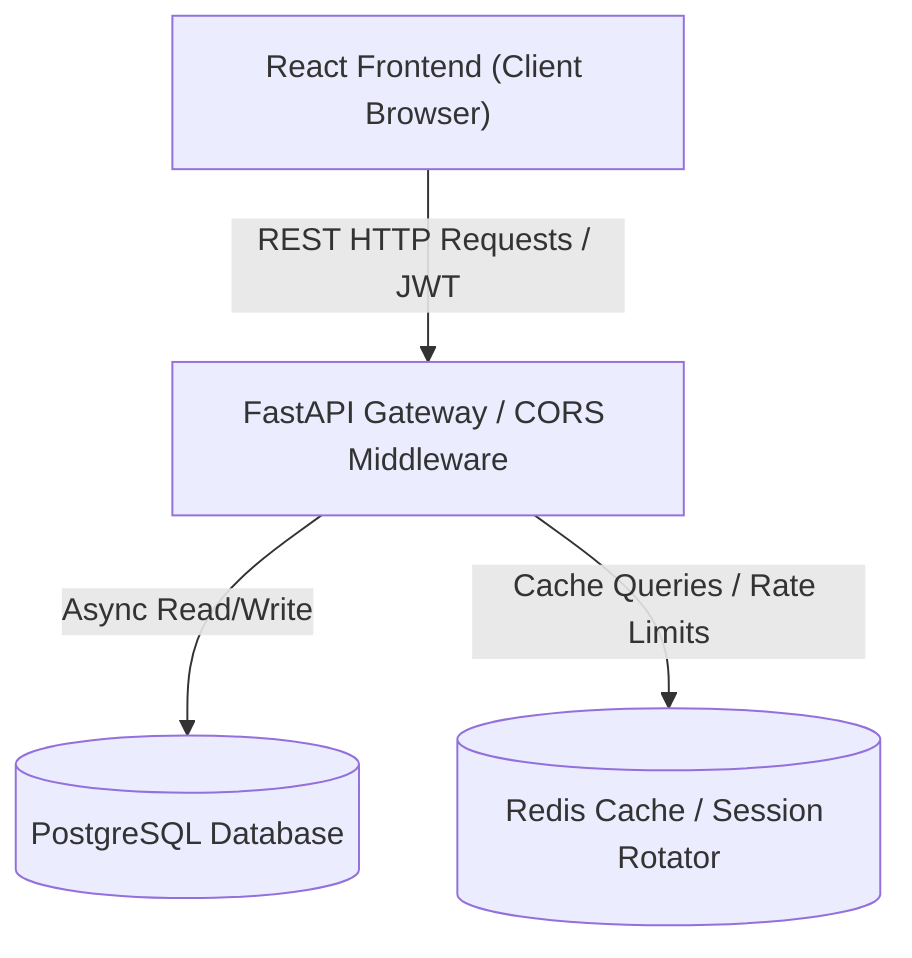

# High-Level Design (HLD) — Akira-PM

This document outlines the high-level system architecture, client-server topology, data flow structures, security boundaries, and infrastructure layers of the Akira-PM collaborative project management SaaS.

---

## 1. System Architecture Overview

Akira-PM uses a decoupled, modern multi-tier client-server architecture designed for high availability, low latency, and secure isolated multi-tenant data storage.

- **Vite React Frontend**: A single-page application (SPA) loaded dynamically by the client browser. State caching is handled locally via Tanstack React Query.
- **FastAPI Backend Gateway**: A high-performance Python ASGI application serving REST endpoints, executing business validations, and enforcing role checks.
- **PostgreSQL Database**: Relational storage engine configured for connection pooling and transactional ACID compliance.
- **Redis Cache**: Optional high-speed in-memory store for rate limiting, notification routing, and active session cache metrics.

---

## 2. Dynamic Data Flows

### A. Authentication & Workspace Swapping
1. **Login Request**: Client POSTs credentials to `/auth/login`. FastAPI validates and returns a signed HS256 JWT access token.
2. **Retrieve Workspaces**: Frontend queries `/workspaces` with the JWT bearer header.
3. **Workspace Handshake**: Setting or switching the active workspace sets the custom `X-Workspace-ID` HTTP header, which is automatically intercepted by backend middlewares to isolate project resources.

### B. Task State Updates & Invalidation Pipeline
1. **Drag Task Card**: Kanban board initiates drag gesture -> emits `tasksApi.moveTask(id, newStatus)` client-side request.
2. **Database Transaction**: Backend checks assignee project permission, writes new status to the database, logs audit record, and returns a task schema.
3. **Optimistic UI Invalidation**: Frontend receives response, registers local success, and triggers a global `invalidateTaskData` call to notify the Dashboard, Tasks lists, and Reports widgets to refetch concurrently.

---

## 3. Security Architecture & Boundary Gates

- **CORS Policies**: Middleware filters origin parameters to block unauthorized cross-origin requests.
- **JWT Lifespans**: Access tokens are signed using cryptographic keys.
- **Role-Based Access Control (RBAC)**: Backend endpoint depends verify member membership (`owner`, `manager`, `developer`, `viewer`) before executing mutations.
- **Trusted Host Headers**: Backend shields routers from header injection attacks.
