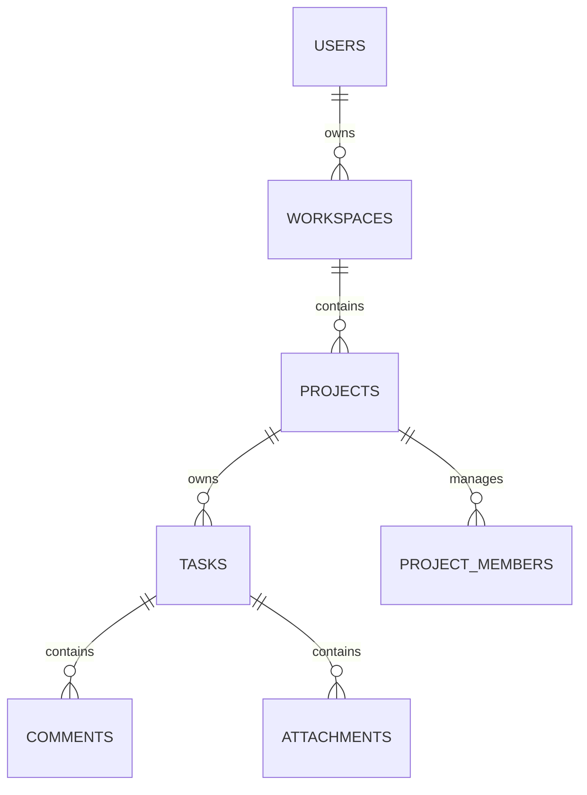

# Low-Level Design (LLD) — Akira-PM

This document contains detailed schemas, module boundaries, component trees, API mappings, and query caches configuration within the Akira-PM application.

---

## 1. Database Schema & Models Detail

The SQL schema maps relational models to enforce relational integrity constraints. All model IDs are stored as `UUID` variables to prevent enumeration attacks.

### Relational Schema Blueprint


#### A. Users Model (`src.models.user.User`)
- `id`: UUID (Primary Key)
- `email`: VARCHAR(255) (Unique, Indexed)
- `hashed_password`: VARCHAR(255)
- `full_name`: VARCHAR(255)
- `is_active`: BOOLEAN (Default: True)

#### B. Workspaces Model (`src.models.workspace.Workspace`)
- `id`: UUID (Primary Key)
- `name`: VARCHAR(255)
- `description`: TEXT
- `owner_id`: UUID (Foreign Key -> Users)

#### C. Projects Model (`src.models.project.Project`)
- `id`: UUID (Primary Key)
- `workspace_id`: UUID (Foreign Key -> Workspaces)
- `name`: VARCHAR(255)
- `description`: TEXT
- `owner_id`: UUID (Foreign Key -> Users)

#### D. Tasks Model (`src.models.task.Task`)
- `id`: UUID (Primary Key)
- `project_id`: UUID (Foreign Key -> Projects)
- `title`: VARCHAR(255)
- `description`: TEXT
- `status`: ENUM (todo, in_progress, in_review, done)
- `priority`: ENUM (low, medium, high, critical)
- `assignee_id`: UUID (Foreign Key -> Users, Nullable)
- `reporter_id`: UUID (Foreign Key -> Users)
- `due_date`: TIMESTAMP (Nullable)

---

## 2. Frontend Services & API Client Layer

The frontend consumes FastAPI backend endpoints using standard Axios instances configured inside `src/services/api/client.ts`.

### Normalization Logic Example
All collection retrievals must be safely checked against response structure discrepancies:
```typescript
async list(config?: RequestConfig): Promise<ApiResponse<Workspace[]>> {
  const res = await apiClient.get<any>("/workspaces", config);
  return {
    ...res,
    data: Array.isArray(res.data) ? res.data : (res.data?.items ?? []),
  };
}
```

---

## 3. Query Key Caches Definition

Vite React components handle caching states utilizing unique array keys.

| Cache Key prefix | Scope | Invalidation Triggers |
| :--- | :--- | :--- |
| `["projects", "list"]` | Available active projects | Creating, editing, or deleting a project |
| `["tasks", "list"]` | Selected project's tasks list | Task mutations (creation, delete, updates) |
| `["dashboard", "overview"]` | Sprint health KPIs and logs | Task updates or status movements |
| `["reports"]` | Workloads and SVG chart items | Task status transitions |
